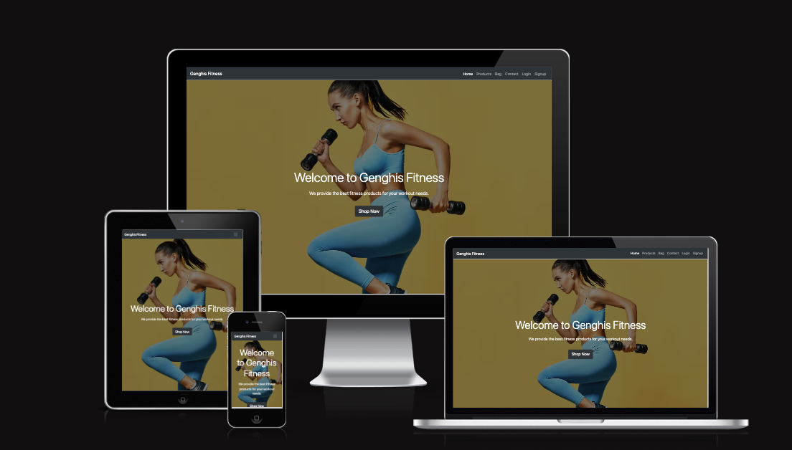
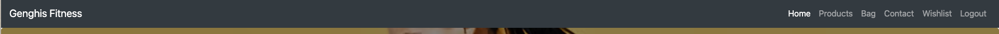
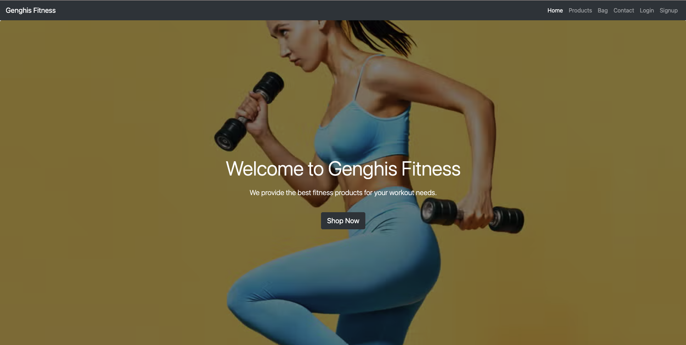
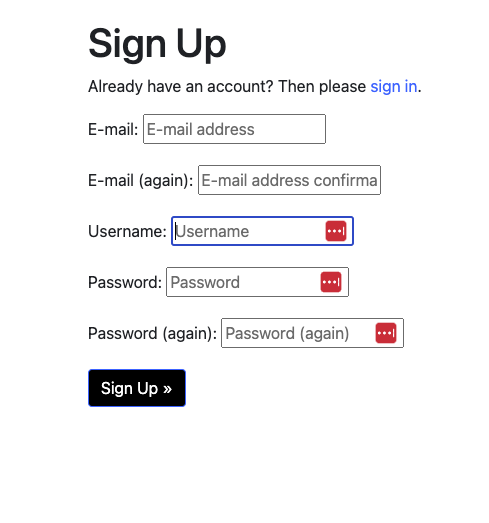
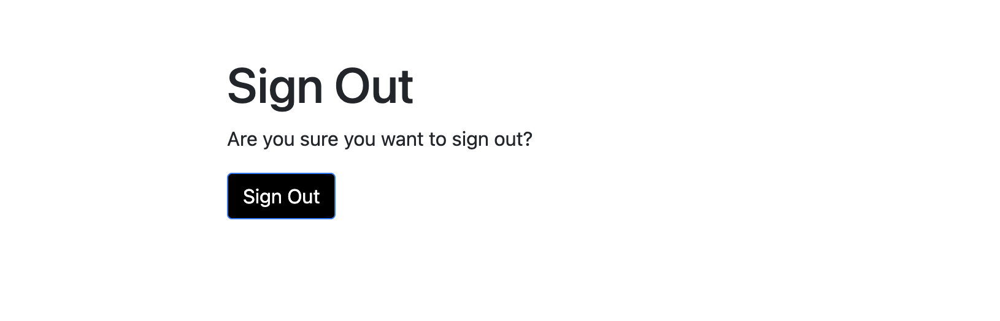
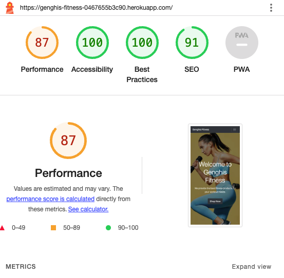

# Genghis Fitness

## Live website Url:
https://genghis-fitness-0467655b3c90.herokuapp.com/

Welcome to Genghis Fitness, your ultimate destination for all your fitness needs. At Genghis Fitness, we take pride in providing high-quality fitness products and accessories that are designed to help you achieve your health and wellness goals.

## **User Stories:**
#### See Genghis fitness project in repository

### Using Agile
 -- later

## **Features** 
####  **Navigation Bar:**
* This has all the elements to be able to navigate across the website. This includes  a _**Home**_ button, _**products**_ button, _**bag**_ button,_**contact**_ button,_**wishlist**_ button and some account buttons like _**login**_. If you are not logged in, aswell as _**signup**_  button. If you are logged in then you will see a _**signout**_ button. These features are so that the user is able to navigate across the website seamlessly, so user can have access to each part of the site without having to travel accross pages to to get to their disired result. This features are so that users are able to login or signup.

#### **landing page:**
 * The landing page describes a about the restaurant while displaying images of the restaurant
 

#### **Footer:**
 * The footer has a couple of features that include links to sign up or login in if the user is not logged im, if the user is logged in it will show links to the bookings page.
  
   

 #### **Booking Page:**
 * The booking page is for users that have created an account or logged in , to fill out a form that allows them to enter their name, email ,phone, special requirements, date, time, so they are able to book at our restaurant  
 
 
 #### **Menu:** 
 * The menu page is to display the lists of food we sell at our restaurant, it gives a insight into the pricing and selection of beverages, meals and deserts available.
  

 #### **Sign-up Page**
 * The sign up page will allow users to create an account by completing a form that is displayed on the page.
 

 #### **My bookings Page**
 * The my bookings page will display all of the currently signed in users bookings that they have made from completing the booking form
  

 #### **Sign-out Page**
 * The sign out page will allow users to sign out of their account.
   

 #### **login Page**
 * The login page will allow users who have created an account to sign in to view their bookings or make another one.
   

## **Future features**:
* To allow users to rate dishes and request different ones
* Allow users to have a loyalty feature based on bookings

# CRUD functionality
## As seen in the my bookings page image
### Add a Booking
* Create or 'add' Booking by filling out the Form on the booking page.

### Update a Booking
* Update or 'edit'a booking by clicking on the edit button found within the my bookings page.

### Delete a Booking
* Delete or 'remove' a booking by clicking on the Delete button found within the my bookings page.

 ## **Technologies Used:**

 ## **Languages**:
* Python - Provides the functionality for the site.
* HTML5 - Provides the content and structure for the website.
* CSS3 - Provides the styling for the website.
* JavaScript - Provides interactive elements of the website

# **Testing:** 

## **HTML Vaildator** 
NO errors or bugs found within the code. Validated on Official W3C Validator - [CLICK HERE](https://validator.w3.org/nu/?doc=https%3A%2F%2Fthe-restaurant.herokuapp.com%2F)   

## **CSS Validator**
NO errors found within CSS code (only errors regarding bootstrap). Validated by  Official Jigsaw - [CLICK HERE](https://jigsaw.w3.org/css-validator/validator?uri=https%3A%2F%2Fthe-restaurant.herokuapp.com%2F&profile=css3svg&usermedium=all&warning=1&vextwarning=&lang=en)

## **Python validator**
No issues found, using PEP8

# Test cases:
## Home Page 
 * Step 1: The user will see the landing page, the tittle of the page at the top left next to navigation links.
 * Step 2: The user will see a full width image with the name The Resturant and statement mordern cuisine.
 * Step 3: The user will notice a paragraph and another full width image
 * Step 4: the user will see a another pararaph and the footer underneath
 * Step 5: the user will see small ammount of text asking to login or sign up (if user is not signed in), if the user is signed ini they will see text asking them to make a booking

## Booking Page
  * Step 1: The user will click on the navigation bar link "booking" 
  * Step 2: the user will be greeted with a form displaying the fields name,email,phone,people,special requirements,date,time.
  * Step 3: The user will be notified if their booking was successful then redirected to thier 'My bookings' page.
  

## Menu page
* The user will click the menu page on the navigation bar.
* The user will see a heading and a paragraph explaining  about the food,
* The user will notice a cocktail menu with prices, description alongside a variety of choices
* The user will see starters along side prices, descriptions and choices 
* the user will see a mains section with prices, descriptions and choice of dishes
* The user will see our tuesday only deal with description and prices

## sign up page
* The user will click on the sign up nav bar button
* The user will see the heading and a message underneath
* The user will see a form with the fields username, email, password, password again, signup button
* The user will see a confirmation message after they signed up and then be redirected to the homepage

## login page 
* The user will click on the login button on the nav bar
* The user will see a form with the fields username, password
* The user will click sign in and will be redirected to home page

## my bookings page
* the user will click on the my account dropdown
* the user will click my booking button
* the user will see their bookings
* the user will be able to edit and delete their bookings using the edit and delete buttons

## signout page
* the user will press on the my account dropdown
* the user will click the signout button
* the user will be redirected to the sign out page 
* the user will see a message saying they successfully signed out

# Bugs
I encounted these bugs:
* user wasnt able to view bookings on their my bookings page
* user couldnt edit booking wouldnt load there previous bookings 
* user would get 404 on delete of booking 
* user couldnt enter a phone number 

## **Light house**

 # **Supported Screen Sizes:**
  I have tested these device sizes using googles developer tools.

  * Iphone 12 pro
  * Iphone SE
  * Iphone XR
  * Nest Hub Max

# **Deployment**
## Heroku
 * Create a account on Heroku
  * Create a new app 
  * Within the new app click on the settings tab
  * Open the reveal config vars section
   * enter in your required config vars:
   
  * Enter in you variables 
  * Navigate to the deploy tab
  * Click on github and enter in the name of your repository 
  * scroll down to the bottom of the page to the manual deploy section
  * choose a branch to deploy (main or master)
  * remove collectstatic and make sure the debug is set to false
  * Press deploy branch

  ## GITPOD:
 * This site was also viewed through a browser using Gitpod, This is how I achieved this :
   * Open your repository through Github.
   * At the top of yout repository click on the gitpod button.
   * When it had loaded adn you can view your code, within the terminal type "python3 manage.py runserver"
   * Wait for the pop up in the bottom right hand corner of Gitpod.
   * Select the _open browser_ option and it will redirect you to your webpage.

# Acknowledgements and Credits
* code institute 
* django docs