# Genghis Fitness

## Live website Url:
https://genghis-fitness-0467655b3c90.herokuapp.com/

Welcome to Genghis Fitness, your ultimate destination for all your fitness needs. At Genghis Fitness, we take pride in providing high-quality fitness products and accessories that are designed to help you achieve your health and wellness goals.

## **User Stories:**
#### See Genghis fitness project in repository

### Using Agile

## Facebook business page:

## Marketing and Business Model

### Social Media Marketing:
* Social media marketing has become the preferred choice for promoting the Genghis Fitness brand due to its extensive reach, precise targeting capabilities, enhanced brand visibility,  
  cost-effectiveness, engagement opportunities, and data-driven insights. By strategically utilizing these platforms, you can establish a strong online presence, engage with your audience, drive brand awareness, and ultimately increase the growth and success of Genghis Fitness in the highly competitive online fitness industry.
### Business model:
* Introduction:
  * By leveraging advanced technology and offering innovative fitness apparel, Genghis Fitness stands out as a trailblazing brand. We will explore the key elements of Genghis Fitness' business model and how it has redefined the online fitness industry.

* Online Accessibility: Genghis Fitness has established a robust online platform that breaks down geographical barriers, providing fitness enthusiasts worldwide with easy access to our products and services.

* Innovative Fitness Apparel: At the heart of Genghis Fitness' is our cutting-edge fitness apparel line. We incorporate state-of-the-art fabric technologies, ergonomic designs, and stylish aesthetics to create a unique fusion of fitness and fashion. These innovative garments enhance performance, comfort, and style, empowering individuals to look and feel their best during workouts.

* Community Support: Genghis Fitness recognizes the importance of building a supportive community. We foster an online environment that connects fitness enthusiasts, encouraging them to share their experiences, challenges, and successes. This sense of community creates a motivating and inspiring space for individuals to connect, support, and uplift each other in their fitness journeys.

* Technological Advancements: While Genghis Fitness focuses primarily on innovative fitness apparel, we also incorporate technological advancements to enhance the customer experience. From seamless online shopping experiences to secure payment systems and fast delivery, we leverage technology to streamline the entire customer journey.

* Continuous Adaptation: Genghis Fitness stays ahead of the curve by continuously adapting to the evolving needs and preferences of their customers. We invest in research and development, keeping abreast of the latest trends in fitness and fashion, and incorporating customer feedback into their product designs and offerings.

* Conclusion:
 * Genghis Fitness has revolutionized the online fitness industry by seamlessly blending fitness and fashion. Their business model, characterized by online accessibility, innovative fitness apparel, community support, technological advancements, and continuous adaptation, has propelled them to the forefront of the industry. By empowering individuals to express their style while pursuing their fitness goals, Genghis Fitness has redefined the way people approach online fitness and fashion. 

## **ER Diagram**
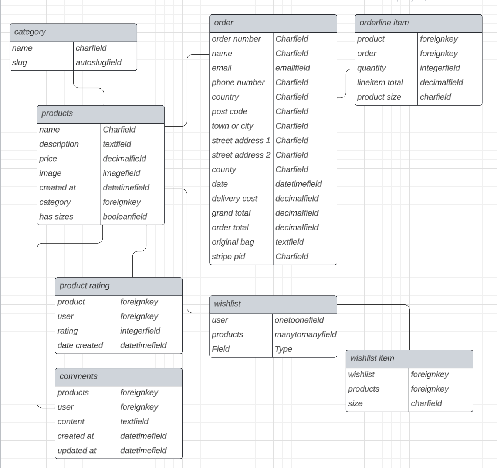

## **Wireframes**
### Home page
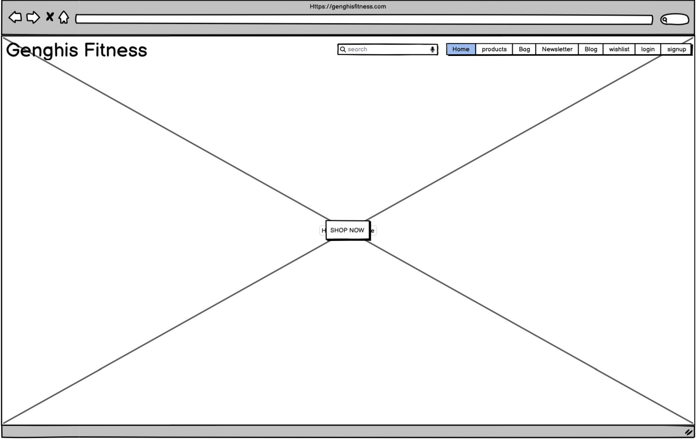
### Product page
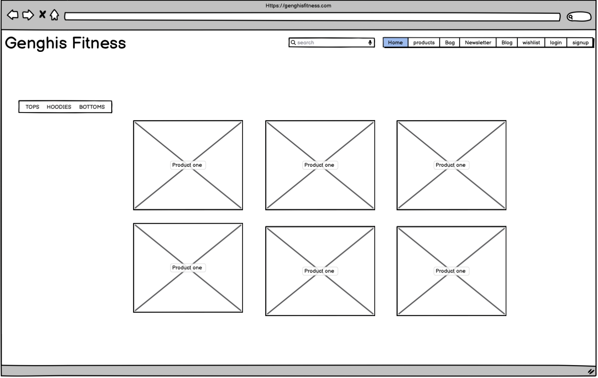
### Product detail page
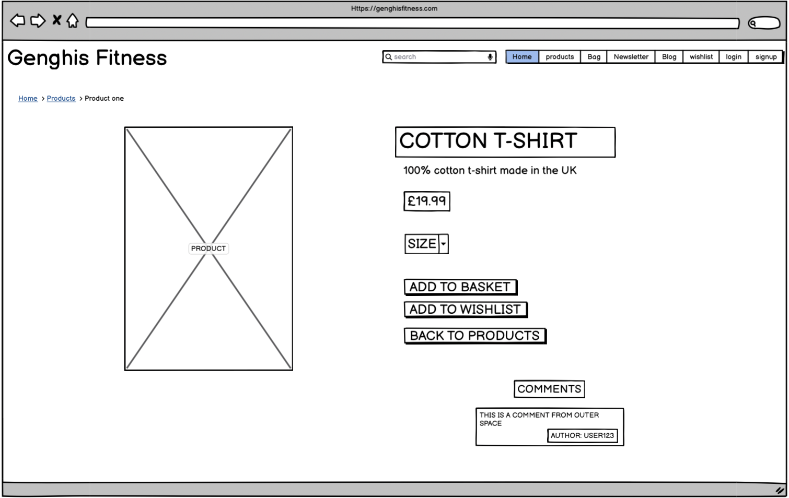
### Bag page
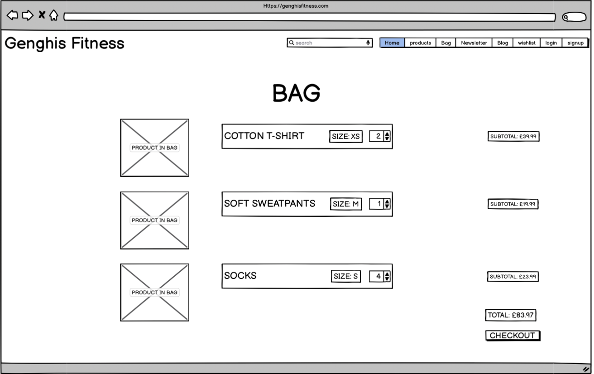
### Checkout page

### Newletter page

### Wishlist page
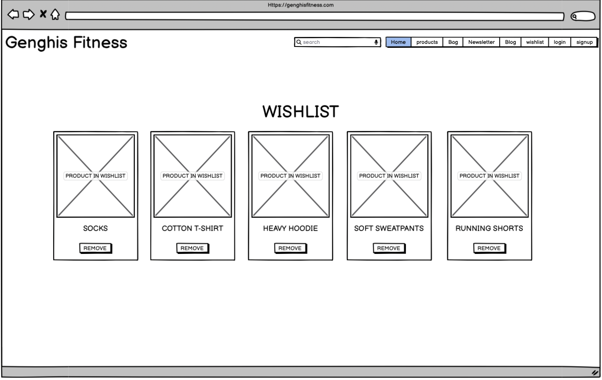
### blog page
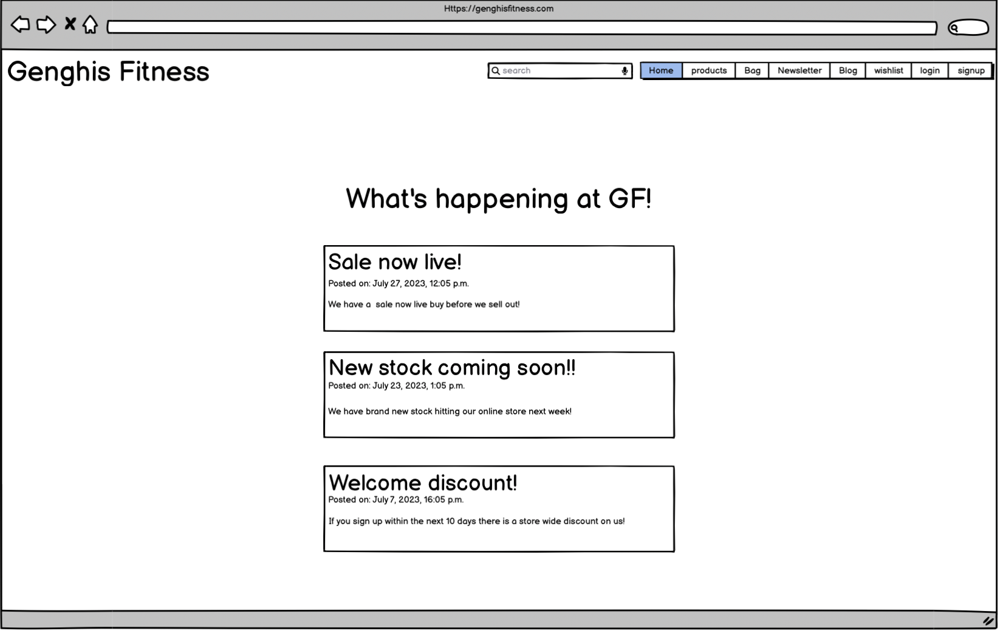
### login page
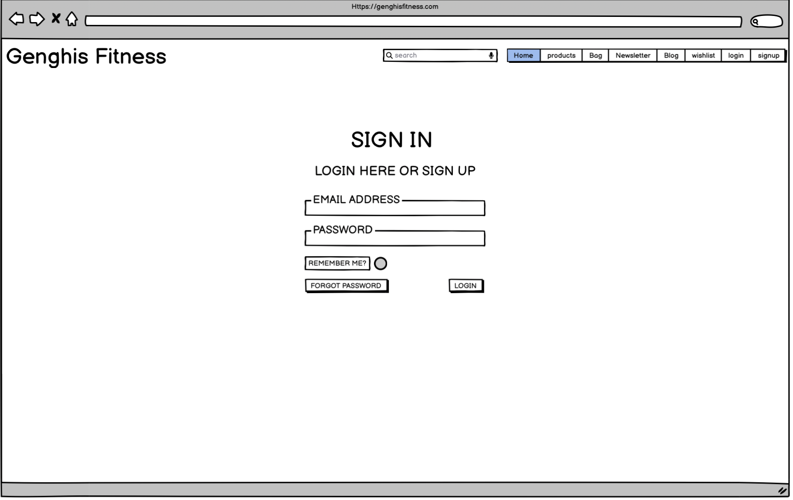
### signup page
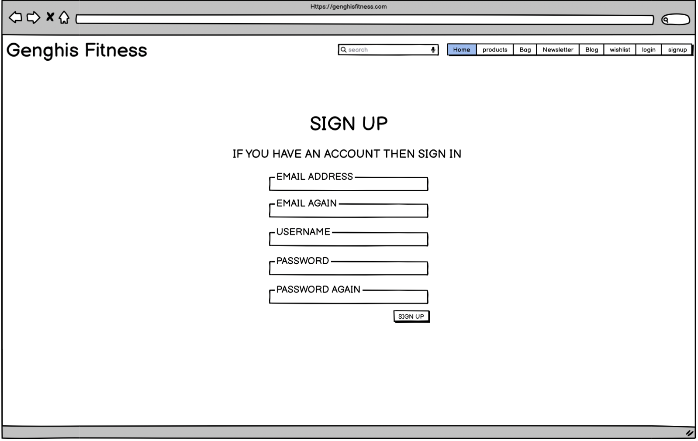
### logout page
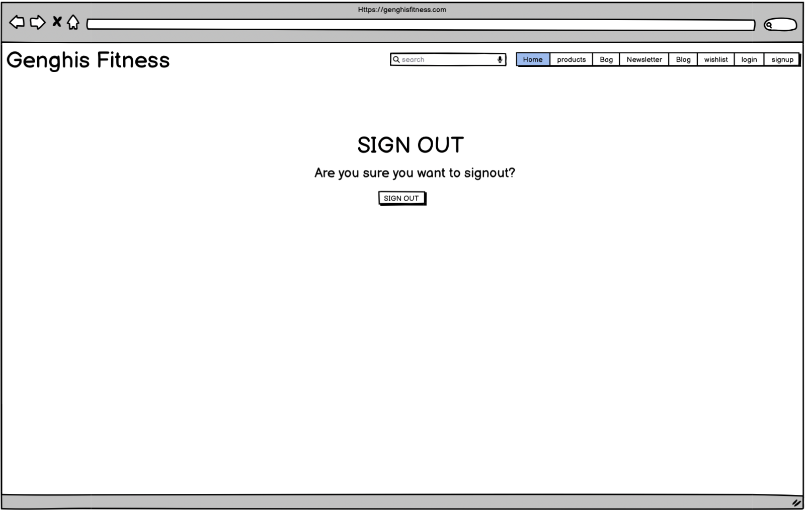

## **Features** 
####  **Navigation Bar:**
* This has all the elements to be able to navigate across the website. This includes  a _**Home**_ button, _**products**_ button, _**bag**_ button,_**newsletter**_ button,_**wishlist**_ button and some account buttons like _**login**_. If you are not logged in, as well as _**signup**_  button. If you are logged in then you will see a _**signout**_ button. These features are so that the user is able to navigate across the website seamlessly, so user can have access to each part of the site without having to travel across pages to to get to their desired result. This features are so that users are able to login or signup.

#### **landing page:**
 * The lading page is simple and easy to navigate it only shows a large image and _**Shop-now**_  button below the navbar 
 

#### **Products Page:**
 * The products page is a simple easy to navigate page that displays the products that are sold at Genghis fitness to the left of the products are the categories which are clickable and will take you to the products specified by the name of the category. To the right of the categories is where all products will be sold.

#### **Product Detail Page:**
 * The product detail page allow users to buy, add to wishlist and rate the products if the user is signed in.

## If Signed In

 
 #### **Category Page :** 
 * This is a simple page that shows all the products in the chosen category.
  * 

#### **Shopping bag page**
 * This page is where users can view all the items they have added to their bag and where they can navigate to the checkout page. Users have the abillity to remove items from their bag or increase the quantity on this page. 
  * 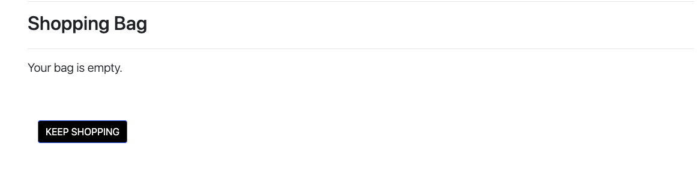
    * 

#### **Checkout Page**
 * On this page the user can fill in their details to place and order, once compelete they will be redirected to the checkout success page. 
  * 

#### **Checkout Success Page**
 * This where the user will see their order and confirming that everything was successful
  * 

#### **Newsletter**
 * This is where users can sign up to a newsletter to receive weekly updates about new products and upcoming events.
   

#### **Wishlist **
* The wishlist page is where users can store items in their wishlist for a later date.
  * 
    * 

#### **Blog page**
* This page is for users to be able to keep track on what is happening at the Genghis Fitness
  * 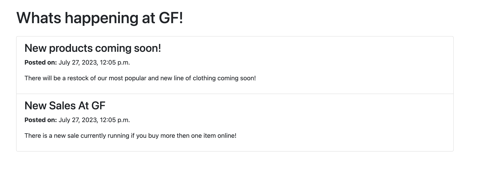

#### **Sign in page**
* Users are able to sign in their prevously created account user this form on the sign in page.
  * 

#### **Sign out page**
* Users can use this page to sign out of their account.
  * 

#### **Sign up page**
* Users can use this page to create a account that will sedn them a email for confirmation.
  * 

#### **Custom 404 Page**
 * This is the page the user will see if they click on a page that doesnt exist.
* 
   

## **Future features**:
* To have active accounts that will store all the information for recurring users, so users can click on their account and retrieve all this information.
* To have a feature were adding items to your Wishlist could enter you into a raffle, where one user a month will win a free item from their Wishlist. 
* To be able to allow users to chat to staff through a chat bubble upon visiting th page so they can ask any question they would like to know about the products.

# CRUD functionality
## Imgaes displayed above in previous content.
### Add a Product
* Users can add items to their shopping bag and Wishlist with the "add to bag" button and "add to Wishlist" button on the product detail page.
### Add a comment
* Users can add comments by selecting the "add comment" button on the product page, this button is on visible if signed in.
### Add a Rating
* User can add a rating if they are signed in, by pressing the "add rating" button on the product page.

### Update a product
* Users can update their shopping bag with the update button on the shopping bag page.
### Update a comment
* Users can update/edit comments they have made on products if the user is signed in and it is a comment they made.

### Remove a product
* Users can remove/ delete items from their Wishlist or from their shopping bag these buttons can be found on both pages.
### Remove a comment
* Users are able to delete comments that they have made if they are signed into their account by using the delete button on the product page.

 ## **Technologies Used:**

 ## **Languages**:
* Python - Provides the functionality for the site.
* HTML5 - Provides the content and structure for the website.
* CSS3 - Provides the styling for the website.
* JavaScript - Provides interactive elements of the website

# **Testing:** 

## **HTML Validator** 
NO errors or bugs found within the code. Validated on Official W3C Validator - [CLICK HERE](https://validator.w3.org/nu/?doc=https%3A%2F%2Fgenghis-fitness-0467655b3c90.herokuapp.com%2F)   

## **CSS Validator**
NO errors found within CSS code. Validated by Official Jigsaw - [CLICK HERE](https://jigsaw.w3.org/css-validator/validator?uri=https%3A%2F%2Fgenghis-fitness-0467655b3c90.herokuapp.com%2F&profile=css3svg&usermedium=all&warning=1&vextwarning=&lang=en)

## **Python validator**
No issues found, using PEP8

# Test cases:
## Home Page 
 * Step 1: The user will see the landing page, the tittle of the page at the top left next to navigation links.
 * Step 2: The User will see the landing page image with shopnow button in the middle of that image. 
  
 

## Products Page
  * Step 1: The user will click on the navigation bar link "Products" or the "Shop Now" button on the landing page. 
  * Step 2: The user will see a list of categories and products to the right of the categories and the heading of products.
  * Step 3: The user will click on the categories or select a product.
  * Step 4: If the user clicked on categories, they would see all products related to that category on the category page.
  * Step 5: If the user clicked on a product, they will be taken to the detail page where users will see the description, price, rating, options to rate, add to wish list or add a comment if the user is signed in. Add to bag button, and lastly a back to products button that will return to their previous page. 
  * Step 6: if the user adds the product to the bag or wishlist they will see a message with the size and name of the product added to the chosen one. 
  * Step 7: If the user adds a rating to the product, then the rating will be increased or decreased and the user will no longer be able to rate the product.
   
   

## Category page
  * Step 1: The user will see the category they are in on the left of the page underneath the heading.
  * Step 2: The user will see the products related to that category on the right of the category name.
  

## Shopping bag page
* Step 1: The user will click on nav bar link "bag”.
* Step 2: The user will see the heading "shopping bag" and a little bit of text saying your bag is empty with a button that says keep shopping
* Step 3: The user will see the message saying that the item has been added to their bag.
* Step 4: If the user has items in their bag, then the user will see text saying "product info" and underneath the image of the "item","name","price","size", "quantity" an "update" button to change the quantity, a "remove" button, "checkout" button and the "total" of the bag.
* Step 5: The user will click on the checkout button and be redirected to the checkout page.
 

## checkout page
* Step 1: The user will be greeted with heading of "checkout”.
* Step 2: The user will be greeted with a large form with the fields: full name, email, phone number, street address 1, street address 2, town or city, county, postal code, country. at the bottom of this form is a card number section where the user will be able to add their card details.
* Step 3: The user will notice that the products they have bought are at the right of this form. which also displayed the name quantity and price of the products.
* step 4: The user will notice the grand total of the products.
* Step 5: The user will notice two buttons at the bottom of the page "adjust bag", "Complete order".
* Step 6: If the user clicks on adjust bag, they will be redirected to the shopping bag page.
* Step 7: If the user clicks on the checkout page they will be taken to the checkout success page.
 

## Checkout Success page
* step 1 : the user will see a  message saying thank you and that the order is complete and that they will receive a email.
* Step 2: The user will see two new fields, order number and order date.
* Step 3: The user will see a list of fields from the previous form showing the user the detail they entered including the item they bought.

## Newsletter page
* Step 1: The user will click newsletter navbar link.
* Step 2: The user will be greeted with a form.
* Step 3: The user will notice a message saying "Subscribe For Weekly updates and exclusive promo codes!" 
* Step 4: The user will see the fields, first name, last name, email address.
* Step 5: The user will then see a message saying, "Thank you for subscribing!"
 

## Wishlist
* Step 1: The user will click on the nav bar button "Wishlist".
* Step 2:The user will see a heading "Wishlist" and a message saying "There are no products in your Wishlist."
* Step 3: The user will see a button saying "Add products to your Wishlist" this button will redirect the user back to the products page where they can add items to their Wishlist.
* Step 4: The user will notice the items in their Wishlist displayed under the heading.
* step 5: The user can remove the item by clicking on the remove button on the item.
 

## Blog
* Step 1: The user will navigate to the blog page using the nav bar and clicking on blog.
* Step 2: The user will see all blogs posted by Genghis fitness.

## Login page 
* Step 1: The user will click on the login button on the nav bar
* Step 2: The user will see a form with the field’s username, password
* Step 3: The user will click sign in and will be redirected to home page

## Sign up page 
* Step 1: The user will click on the signup button on the nav bar
* Step 2: The user will see a form with the field’s Email, Email again, username, password and password again.
* Step 3: The user will click sign up and they will be redirected to the login success page that displays a message to verify their email address and a button to return to the homepage

## Signout page
* Step 1: The user will click on the signout button on the navbar.
* Step 2: The user will see two bits of text saying "Sign Out" for the header and  "Are you sure you want to sign out?" as an informative message below.
* Step 3: The user can click on the sign out button, which will redirect them back to the homepage.

# Bugs
I encounted these bugs:
* submitting a rating would redirect you to a blank page
* payments on stripe wasnt successful
* Side scrolling on newletter page
* ratings wasnt being added up correctly
* Users wouldnt see a success messasge when adding products to wishlist
* when removing a item form the bag it wouldnt remove all items
* when trying to remove a certain size of a item it would remove all of the same items.
* cateogory links wouldnt show the items associated with those categories.

## **Light house**
 

 # **Supported Screen Sizes:**
  I have tested these device sizes using googles developer tools.

  * Iphone 12 pro
  * Iphone SE
  * Iphone XR
  * Nest Hub Max

# **Deployment**
## Heroku
 * Create a account on Heroku
  * Create a new app 
  * Within the new app click on the settings tab
  * Open the reveal config vars section
   * enter in your required config vars for example the keys to your respository and database
  * Enter in you variables 
  * Navigate to the deploy tab
  * Click on GitHub and enter in the name of your repository 
  * scroll down to the bottom of the page to the manual deploy section
  * choose a branch to deploy (main or master)
  * remove collect static and make sure the debug is set to false
  * Press deploy branch

  ## GITPOD:
 * This site was also viewed through a browser using Gitpod, This is how I achieved this :
   * Open your repository through Github.
   * At the top of your repository click on the gitpod button.
   * When it had loaded adn you can view your code, within the terminal type "python3 manage.py runserver"
   * Wait for the pop up in the bottom right-hand corner of Gitpod.
   * Select the _open browser_ option and it will redirect you to your webpage.

# Acknowledgements and Credits
* Code institute 
* django docs
* Youtube
* Stack overflow

